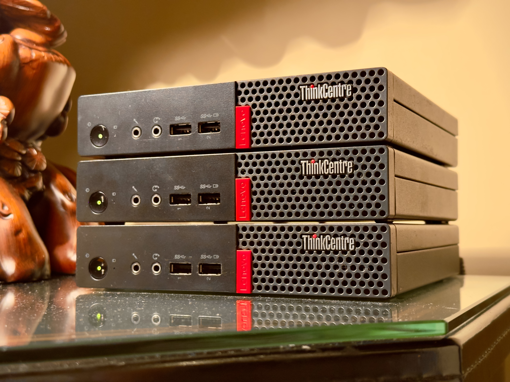

<p align="center">
  
  <br>
  
  <br>
  Homelab hardware: ThinkCenter M710q Tiny, Intel i5-7500T and 8GB RAM
  <br>
  <br>
</p>

[](https://nixos.org)
[](https://chengeric.com/homelab?gh)


## Quick Start

**Prerequisites:** Git and basic terminal knowledge. Nix will be installed automatically.

### One-liner Install
```bash
# macOS or NixOS
bash -c "$(curl -fsSL https://raw.githubusercontent.com/orther/doomlab/main/install.sh)"
```

### After Install
```bash
# Deploy local changes
just deploy macos        # macOS
just deploy MACHINE      # NixOS

# Update everything  
just up                  # Update flake inputs
just deploy MACHINE      # Apply updates
```

**Need help?** Check our [setup guide](docs/SETUP.md) or [troubleshooting guide](docs/TROUBLESHOOTING.md).

## Architecture Overview

This configuration manages **11 different machines** across three platforms using a modular approach:

```
doomlab/
├── machines/           # Host-specific configurations (11 total)
│   ├── macos/         # M1 MacBook Air  
│   ├── noir/          # Main homelab server
│   ├── wsl/           # Windows Subsystem for Linux
│   └── ...            # 8 other specialized configs
├── modules/           # Reusable components
│   ├── nixos/         # NixOS-specific modules
│   ├── darwin/        # macOS-specific modules  
│   └── shared/        # Cross-platform modules
├── services/          # Self-hosted applications
│   ├── nextcloud.nix  # File sync & sharing
│   ├── jellyfin.nix   # Media server
│   └── tailscale.nix  # VPN mesh network
└── secrets/           # Encrypted secrets (SOPS)
```

**Key Technologies:**
- **Nix Flakes** - Reproducible system configurations
- **Home Manager** - User environment & dotfiles  
- **SOPS** - Encrypted secrets management
- **Impermanence** - Root on tmpfs for stateless systems

## Features & Highlights

- ❄️ **Nix flakes** handle upstream dependencies and track latest stable release of Nixpkgs (currently 24.11)
- 🏠 **[home-manager](https://github.com/nix-community/home-manager)** manages dotfiles across all platforms
- 🍎 **[nix-darwin](https://github.com/LnL7/nix-darwin)** provides declarative macOS configuration
- 🤫 **[sops-nix](https://github.com/Mic92/sops-nix)** manages encrypted secrets with age/GPG
- 🔑 **Remote initrd unlock** system to decrypt drives on boot over SSH
- 🌬️ **Root on tmpfs** aka [impermanence](https://grahamc.com/blog/erase-your-darlings/) for truly stateless systems
- 🔒 **Automatic Let's Encrypt** certificate registration and renewal
- 🧩 **Self-hosted services**: Tailscale, Nextcloud, Jellyfin, Homebridge, Scrypted, and more
- ⚡️ **`just` command runner** provides simple aliases for complex Nix operations
- 🤖 **Daily auto-updates** via GitHub Actions and systemd timers
- 🧱 **Modular architecture** promotes readability and reusability
- 📦 **Custom ISO/WSL images** available in [releases](https://github.com/orther/doomlab/releases)

## Detailed Installation

> [!NOTE]
> For most users, the [Quick Start](#quick-start) section above is sufficient. This section provides detailed platform-specific instructions and advanced options.

### macOS Installation

The install script uses the [Determinate Systems Nix installer](https://zero-to-nix.com/start/install) and prompts to install the doomlab configuration.

```bash
bash -c "$(curl -fsSL https://raw.githubusercontent.com/orther/doomlab/main/install.sh)"
```

**What this does:**
1. Installs Nix with flakes enabled
2. Clones this repository 
3. Applies the macOS configuration
4. Sets up home-manager for user dotfiles

**Requirements:** Admin privileges for system configuration

### NixOS Installation (Advanced Users)

> [!WARNING] 
> This configuration is designed for my specific hardware. To use on your hardware:
>
> 1. Create your machine config in `machines/your-hostname/`
> 2. Update `flake.nix` with your machine entry
> 3. Configure SOPS secrets or disable them entirely
> 4. Review hardware-specific settings

**From NixOS ISO:**
```bash
bash -c "$(curl -fsSL https://raw.githubusercontent.com/orther/doomlab/main/install.sh)"
```

**Custom ISO Creation:**
Build a custom ISO with your SSH keys for remote installation:
```bash
just build-iso  # Creates ISO in result/
```

### Windows Subsystem for Linux (WSL)

1. **Enable WSL:**
   ```powershell
   wsl --install --no-distribution
   ```

2. **Download and Import:**
   ```powershell
   # Download nixos-wsl.tar.gz from releases page
   wsl --import NixOS $env:USERPROFILE\NixOS\ nixos-wsl.tar.gz
   ```

3. **Launch:**
   ```powershell
   wsl -d NixOS
   ```

## Daily Commands

The `justfile` provides convenient aliases for common operations. Run `just --list` to see all available commands.

### Deployment
```bash
# Local deployment
just deploy macos                    # Deploy to current macOS machine
just deploy nixos-machine           # Deploy to NixOS machine locally

# Remote deployment  
just deploy noir 10.4.0.26         # Deploy to remote machine at IP
```

### System Maintenance
```bash
just up                             # Update flake inputs (like npm update)
just gc                             # Garbage collect old generations
just repair                         # Verify and repair Nix store
```

### Secrets Management
```bash
just sopsedit                       # Edit encrypted secrets file
just sopsrotate                     # Rotate all secret keys
just sopsupdate                     # Update keys for all secrets
just fix-sop-keystxt               # Fix age keys after host key changes
```

### Development & Testing
```bash
just lint                           # Check Nix code with statix
just build-iso                      # Build custom NixOS ISO
```

**Pro tip:** Commands are designed to be run from the repository root. See the [justfile](justfile) for implementation details.

## 📚 Documentation

- **[Setup Guide](docs/SETUP.md)** - Detailed walkthrough for first-time users
- **[Architecture](docs/ARCHITECTURE.md)** - System design and module organization  
- **[Secrets Management](docs/SECRETS.md)** - Complete SOPS workflow guide
- **[Troubleshooting](docs/TROUBLESHOOTING.md)** - Common issues and solutions

## 🎯 Future Roadmap

- [ ] [Secure boot](https://github.com/nix-community/lanzaboote) with lanzaboote
- [ ] Binary caching for faster builds
- [ ] [Wireless remote unlocking](https://discourse.nixos.org/t/wireless-connection-within-initrd/38317/13) 
- [ ] Automated health monitoring and alerting
- [ ] Migration to NixOS 24.11 when stable

## 📖 Learning Resources

### Essential References
- [Search NixOS options](https://search.nixos.org/options) - Official option database
- [Home Manager Option Search](https://mipmip.github.io/home-manager-option-search/) - User environment options
- [Darwin Configuration Options](https://daiderd.com/nix-darwin/manual/index.html) - macOS-specific options

### Beginner Guides  
- [NixOS and Flakes Book](https://nixos-and-flakes.thiscute.world/) - Excellent beginner introduction
- [Zero to Nix](https://zero-to-nix.com/) - Official getting started guide
- [Nix Pills](https://nixos.org/guides/nix-pills/) - Deep dive into Nix concepts

### Advanced Topics
- [Handling Secrets in NixOS](https://lgug2z.com/articles/handling-secrets-in-nixos-an-overview/) - Security best practices
- [Impermanence Guide](https://elis.nu/blog/2020/05/nixos-tmpfs-as-root) - Root on tmpfs setup  
- [NixOS on Hetzner](https://mhu.dev/posts/2024-01-06-nixos-on-hetzner) - Remote server deployment

---

**Questions?** Open an [issue](https://github.com/orther/doomlab/issues) or check the [discussions](https://github.com/orther/doomlab/discussions).
